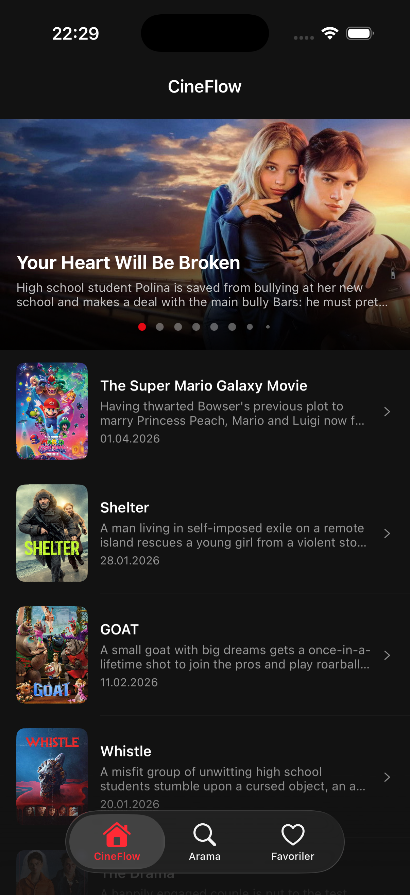
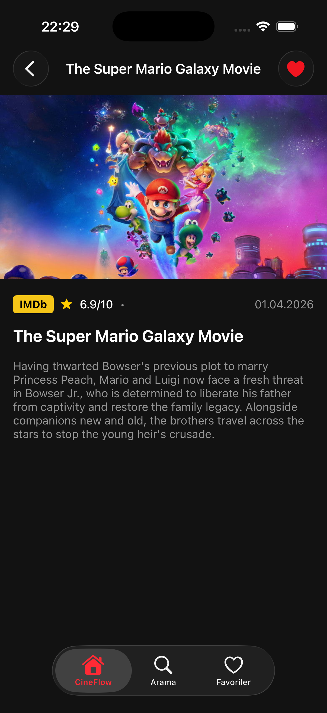
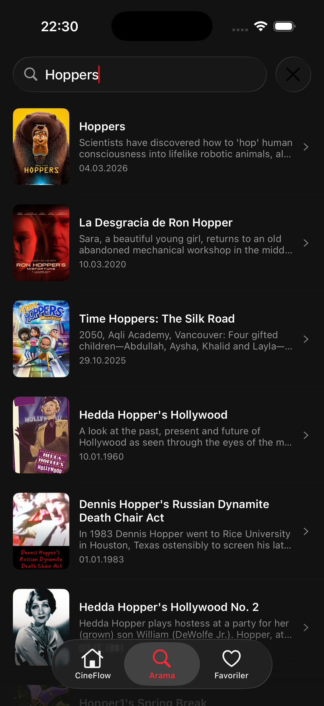
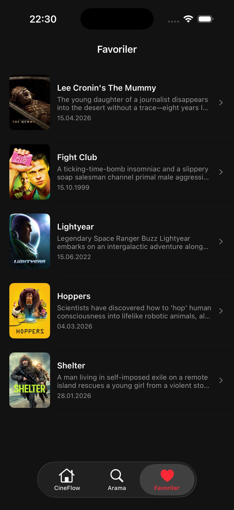

# CineFlow

Movie discovery app using TheMovieDB API.

## Screenshots

| Ana Sayfa | Film Detay | Arama | Favoriler |
|:---------:|:----------:|:-----:|:---------:|
|  |  |  |  |

## Features
- MVVM Architecture
- Now playing slider & upcoming movies list
- Pagination & pull to refresh
- Movie detail with IMDb redirect
- Search movies
- Favorites

## Pods
```
pod 'Alamofire'
pod 'Kingfisher'
pod 'SnapKit'
```

## Installation
1. `pod install`
2. Open `CineFlow.xcworkspace`
3. Add your TMDb API key in `AppConstants.swift`
